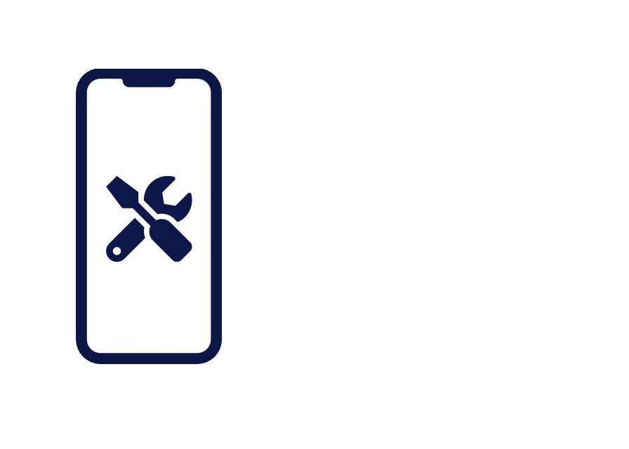

  

<h1 align="center">IService Phone Repair Company Website</h1>

    This repository is <b>private</b> and the source code is not publicly accessible.
     
    Visit the <a href="https://iservice-esbjerg.dk">website</a> to see the project in action!
     

---

## 📖 Introduction

This repository houses the source code for [The IService website](https://iservice-esbjerg.dk), which is designed to Easily show customers the prices for getting their phone repaired. As the implementation details are sensitive, we have opted to keep the source code private. If you have legitimate access needs, please refer to the Access tab.

### 🌐 Website

You can view the live version of this project here: [IService-esbjerg.dk](https://iservice-esbjerg.dk)

### 🔒 Access

If you are a collaborator or a team member and require access to the repository, please ensure you have the necessary permissions on GitHub, or contact the admin on mail at [nicklas.nick@live.dk](mailto:nicklas.nick@live.dk) for more information.

### 📄 License

This project and its contents are proprietary software; all rights are reserved.

### 🤝 Contributing

Currently, we are not accepting any public contributions to this repository. However, if you have suggestions or feedback, feel free to open an issue or contact [Me](mailto:nicklas.nick@live.dk).

### ✉️ Contact

For assistance or general inquiries, please email [nicklas.nick@live.dk](mailto:nicklas.nick@live.dk).

### 💡 Suggestions

We value your input — we're always looking for ways to improve. If you have any suggestions, please email us at [nicklas.nick@live.dk](mailto:nicklas.nick@live.dk).

---

    © 2024 [IService-esbjerg]. All Rights Reserved.

